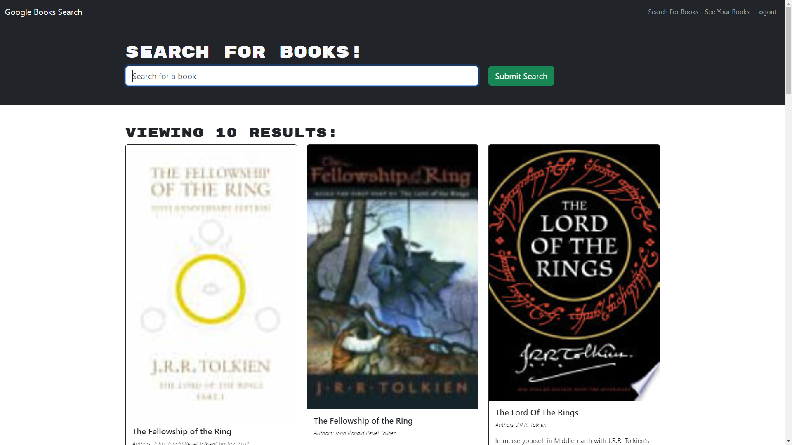

# book-search

## Description

Provide a short description explaining the what, why, and how of your project. Use the following questions as a guide:

- What was your motivation?

To create a webpage where users can create and account, and search for books, when a user searches for a book they can add the book to their list, or remove a book from their list.
  
- Why did you build this project? (Note: the answer is not "Because it was a homework assignment.")

To have a complete MERN stack application that works and allows CRUD operations.

- What problem does it solve?

Being able to create and account, login, serach for your favorite book and add the book the your list. To also allow the user to remove a book from their list and to be able logout of the application.

- What did you learn?

  MERN stack, how to set up clusters in MongoDB Atlas and how to connect it to the application.

## Table of Contents (Optional)

If your README is long, add a table of contents to make it easy for users to find what they need.

- [Installation](#installation)
- [Usage](#usage)
- [Credits](#credits)
- [License](#license)

## Installation

What are the steps required to install your project? Provide a step-by-step description of how to get the development environment running.

Clone the repository, open in VSCode or other IDE.

## Usage

Provide instructions and examples for use. Include screenshots as needed.

Run npm i in the terminal at the root level, then run npm run develop to start the application. Navigate to the browser at http://localhost:3001, to view the application for testing.
To create an account, follow instructions for creating account on the sign up page. Once account is created you will be redirected and logged in. To search for books, type a book title or author into the search field, you will be redirected to a search results page displaying the results of your search. To add a book to your list click on the save book button located at the bottom of the book description. To view your list click See Your Books in the naviagtion bar, once redirected you will see a list of books in your list. To remove a book from your list click the button for Delete this Book. To logout click logout in the navigation bar and you will be redirected to the homepage with an option to sign up or login.

To add a screenshot, create an `assets/images` folder in your repository and upload your screenshot to it. Then, using the relative filepath, add it to your README using the following syntax:




    ```md
    
    ```

## Credits

List your collaborators, if any, with links to their GitHub profiles.

If you used any third-party assets that require attribution, list the creators with links to their primary web presence in this section.

If you followed tutorials, include links to those here as well.

## License

The last section of a high-quality README file is the license. This lets other developers know what they can and cannot do with your project. If you need help choosing a license, refer to [https://choosealicense.com/](https://choosealicense.com/).

---

🏆 The previous sections are the bare minimum, and your project will ultimately determine the content of this document. You might also want to consider adding the following sections.

## Badges


Badges aren't necessary, per se, but they demonstrate street cred. Badges let other developers know that you know what you're doing. Check out the badges hosted by [shields.io](https://shields.io/). You may not understand what they all represent now, but you will in time.

## Features

If your project has a lot of features, list them here.

## How to Contribute

If you created an application or package and would like other developers to contribute it, you can include guidelines for how to do so. The [Contributor Covenant](https://www.contributor-covenant.org/) is an industry standard, but you can always write your own if you'd prefer.

## Tests

Go the extra mile and write tests for your application. Then provide examples on how to run them here.
